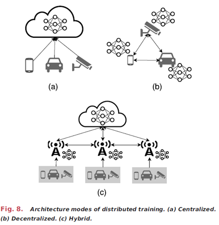

## CP10
> Submit a revised project report using the feedback from reviewers. Prepare a 500 word narrative summarizing the suggested revisions. You may also discuss what you would do if you were to redo the paper. Place the revised presentation and narrative on the web and ensure that the course web-site has a link to your material.

Final Report Downloads:  [docx](../images/Project/CP10_FinalReport.docx), [pdf](../images/Project/CP10_FinalReport.pdf)

Other Groups' Reviews of Our Presentation: [G1](https://docs.google.com/document/d/1G98qa-cmhwUY69KIuVxGEmiH29zyiijw/edit), [G3](https://docs.google.com/document/d/1lXxo7Ygnl28IlspXAzFZNEmgsEQBoNL_jnml4UdNHgE/edit?pli=1&tab=t.0)

The main critique from group G3 is that our presentation could utilize more intuitive diagrams and visualizations to help with our explanations of the project.  To address their concern, we are utilizing an image from one of the papers we used in our final report.  The image, shown below, better highlights the differences between edge and centralized networks.

G1's critiques were...