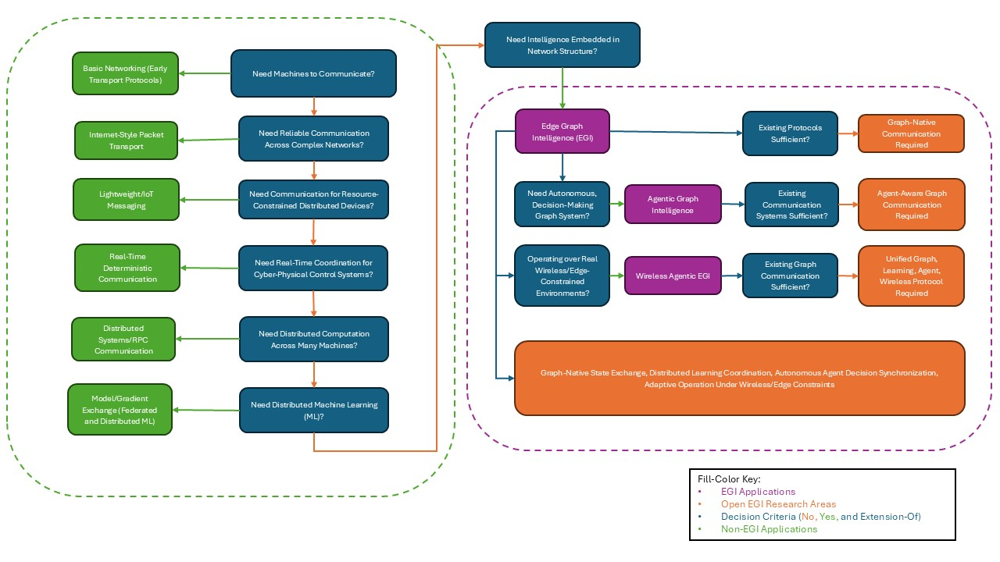

## CA4
> Review the presentation on papers Q and R using the following criteria: technical accuracy of review, presentation (easy to understand, examples), analysis and insights beyond the paper summary available on textbook web-site. You are expected to upload the electronic copy of your 500 word narrative (for each paper) summarizing the findings as well as a list of 3 to 4 specific improvements onto your class webpage. 

*Q: [Foundation Models for Scientific Discovery and Innovation](https://www.nationalacademies.org/read/29212/chapter/1):*

Group three's presentation on this paper is expected to be on February 24th, 2026.

*R: [A Survey on Uncertainty Quantiifcation Methods for Deep Learning](https://dl.acm.org/doi/10.1145/3786319)*

This survey's anticipated presentation date is March 5th, 2026, by Group 6.

## CP2
> Identify key sources, types of evidence. Include a list of sources. The potential source for the paper is a recent conference proceedings or a journal in the data science area. Students should visit library, web (e.g. Google Scholar, DBLP, ACM DL, IEEE DL for papers and amazon.com for book) and fellow students specializing in the data science research area, to check the availability of the sources before listing them. Provide summary of search results from DBLP and amazon.com to illustrate the effort. 

Noah: I began by checking the [Project Resources](https://www.spatial.cs.umn.edu/Courses/Spring26/8715/index.php?page=project) page, starting with Prof. Ce Yang at the UMN CFANS Ag. Robotics Laboratory. We reached out for comment and to start a discussion but never heard back in the limited time for this assignment. We also reviewed the linked resources, but found that beyond general awareness there was not much real info to go off of. Thus began stage two.

Stage two was using Google Scholar combined with resultant paper citations. There were two main searches I did, particularly looking for surveys, and then I found other papers by checking the citations of those surveys and papers that cited the 'parent' survey. The search taxonomy and highlights are roughly as follows:

Google Scholar search "drone edge computing":

[1] "[*A Survey on the Convergence of Edge Computing and AI for UAVs: Opportunities and Challenges*](https://ieeexplore.ieee.org/document/9778241)" - published 2022

[2] "[*Edge Graph Intelligence: Reciprocally Empowering Edge Networks With Graph Intelligence*](https://ieeexplore.ieee.org/document/10835104/)" - published 2025, cites [1], cites >300 other relevant papers

[3] "[*Edge Intelligence Enhanced Monte Carlo Tree Search for Virtually Coupled Train Set Optimal Control*](https://ieeexplore.ieee.org/document/10945675)" - published 2025, cites [2]

[4] "[*Grape: Efficient Spatiotemporal Prediction Services with Stale Sensing Streams*](https://ieeexplore.ieee.org/document/11315101)" - published 2022, cites [2]

[5] "[*Hybrid Semantic-Graph Clustering: Enhancing Customer Segmentation with LLMs and Graph Neural Networks*](https://ieeexplore.ieee.org/document/11170722)" - published 2022, cites [2]

Google Scholar Search "spatio temporal data, edge computing, drone":

[6] "[*UAV-assisted Joint Mobile Edge Computing and Data Collection via Matching-enabled Deep Reinforcement Learning*](https://arxiv.org/abs/2502.07388)" - published 2025

[7] "[*AerialDB: A federated peer-to-peer spatio-temporal edge datastore for drone fleets*](https://arxiv.org/pdf/2508.07124)" - published 2025

Google Scholar search "graph intelligence communication":

[8] "[*Agentic Graph Neural Networks for Wireless Communications and Networkings Towards Edge General Intelligence: A Survey*](https://ieeexplore.ieee.org/abstract/document/11339899)

Google Scholar search "communication protocols graph theory":

[9] "[*Using Graph Theory to Improve Communication Protocols in AI-Powered IoT Networks *](https://yuktabpublisher.com/index.php/TMS/article/view/129) - published 2024

[10] "[*A new graph theory based routing protocol for wireless sensor networks*](https://www.academia.edu/download/38126526/1211jgraph02.pdf) - published 2011


From these searches I concluded I had enough from the papers themselves and the citations to go off of. *Edge Graph Intelligence: Reciprocally Empowering Edge Networks With Graph Intelligence* [2] especially provides good 'key concept' sections, references PyG 2.0, and Graph Neural Networks/Edge Graph Intelligence. From the background I've developed in this course, this felt like the 'winner' in terms of a good spot to search for specific problems.

Joe:  I found that the main situation in which we would use Edge Computing is when the data collected from the edge sources is massive enough to make transmission more costly (time and memory) than training locally.  This was discussed in the seventh reference of *Edge Graph Intelligence* [2], *Edge Computing: Vision and Challenges* [11].

The paper [11] also detailed several examples of edge computing in practice, with video analytics and the 'smart city' paradigm being a potential avenue for drone pathing and interception technology to take advantage of.  Video analytics is a common feature necessary for autonomous robots, and will likely be a part of any drone agent we use for our project.  The smart city paradigm is a framework in which centralized processing requests can be exectued by edge devices.

Should time permit, we may also be able to utilize the AIFS weather forecasting model [12] to provide climate analysis and predictions for the drone agents or edge nodes that transmit to the drones.  We can also attempt to utilize the DOPBC method introduced in *Distributed Online Convex Optimization with Nonseparable Costs and Constraints* [13] that was published the week before this page was added to our website.

[11] "[*Edge Computing: Vision and Challenges*](https://ieeexplore-ieee-org.ezp2.lib.umn.edu/document/7488250) - published 2016

[12] [*An update to ECMWF's machine-learned weather forecast model AIFS*](https://arxiv.org/abs/2509.18994)

[13] [*Distributed Online Convex Optimization with Nonseparable Costs and Constraints*](https://arxiv.org/abs/2602.10452v1)

## CP3
> Summary of key readings. This summary is more than a list of summaries for individual research papers using the hints in the section on analyzing a research paper. A possible approach is to find a common abstract problems adressed by all the paper and develop a simple classification system to compare the solutions proposed in individual papers. Look at the "literature survey" sections of the papers in the reading list (particularly the thsoe from ACM Computing Surveys) for examples. Provide the summary of key readings in three formats: 
> 1) a laundry list; 
> 2) a decision table; and 
> 3) a decision tree.

The problem we're choosing to look at specifically is Edge Graph Intelligence communication protocols, or rather the lack thereof. Paper [2] discusses this at the architectural level and paper [10] shows autonomous, decision-making graph agents communicating over real wireless systems, but our current communication methods are not optimal for EGI and thus must evolve.

### 1. Laundry list (requirements that force a new solution)

#### Graph / Structural
- Distributed graph state exchange
- Incremental topology updates
- Graph embedding communication
- Dynamic graph evolution support

#### Learning / Intelligence
- Communication embedded in learning loop
- Distributed inference coordination
- Model-aware communication scheduling
- Exchange of learned representations (not raw data)

#### Agentic / Decision Layer
- Communication triggered by agent decisions
- Support for cooperative multi-agent behavior
- Decentralized decision synchronization
- Communication for action coordination (not just data)
- Adaptive communication based on policy / reward

#### Wireless / Physical Constraints (NEW)
- Bandwidth and spectrum awareness
- Interference-aware communication
- Resource-constrained scheduling
- Communication under unreliable links
- Joint optimization of communication + learning + control

### 2. Decision Table

| System Purpose                             | Communication Style                         | Primary Benefit                                          | Missing for EGI + Agentic GNN                                                        |
| --------------------------------------- | ------------------------------------------- | ------------------------------------------------- | ------------------------------------------------------------------------------------ |
| Internet reliability                    | Packet transport                            | Delivery guarantees                               | No intelligence                                                                      |
| IoT systems                             | Lightweight messaging                       | Efficient data transfer                           | No learning                                                                          |
| Distributed ML                          | Gradient exchange                           | Model coordination                                | Not graph-aware                                                                      |
| Edge Graph Intelligence                 | Graph-aware exchange                        | Distributed graph learning                        | Not decision/agent-aware                                                             |
| Agentic Graph Wireless Intelligence | Needed: Agent-aware graph communication | Autonomous distributed intelligence over wireless | No existing protocol supports learning + graph + autonomy + wireless constraints |

### 3. Decision Tree



```
Start: Need machines to communicate?
├── Simple point-to-point data transfer sufficient?
│     └── Yes → Basic networking (early transport protocols)
│
└── No → Need reliable communication across complex networks?
      └── Yes → Internet-style packet transport
            Provides: reliable delivery, routing, congestion control
            Limitation: communication is data-agnostic, not intelligence-aware

            ↓

      Need communication for resource-constrained distributed devices?
      └── Yes → Lightweight / IoT messaging
            Provides: low overhead, async messaging, scalability
            Limitation: moves data only, no learning or topology awareness

            ↓

      Need real-time coordination for cyber-physical / control systems?
      └── Yes → Real-time deterministic communication
            Provides: low latency, scheduling, reliability
            Limitation: control-centric, not intelligence-centric

            ↓

      Need distributed computation across many machines?
      └── Yes → Distributed systems / RPC communication
            Provides: task coordination, synchronization
            Limitation: node-centric, ignores graph relationships

            ↓

      Need distributed machine learning?
      └── Yes → Model / gradient exchange (federated & distributed ML)
            Provides: distributed training, privacy-preserving learning
            Limitation:
                - Model-centric, not graph-centric
                - Static communication structure
                - Weak support for dynamic edge systems

            ↓

      Need intelligence embedded in network structure?
      └── Yes → Edge Graph Intelligence (EGI) begins
            Requires:
                - Graph-aware communication
                - Distributed graph learning
                - Topology-aware coordination
                - Efficient graph state exchange

            Existing protocols sufficient?
            └── No → Graph-native communication required
                     (FIRST OPEN PROBLEM)

                     ↓

            Need autonomous, decision-making distributed graph systems?
            └── Yes → Agentic Graph Intelligence
                     Requires:
                        - Decision-aware communication
                        - Multi-agent coordination
                        - Policy / action synchronization
                        - Communication embedded in control loop

                     Existing graph communication sufficient?
                     └── No → Agent-aware graph communication required
                              (SECOND OPEN PROBLEM)

                              ↓

            Operating over real wireless / edge-constrained environments?
            └── Yes → Wireless Agentic EGI
                     Requires:
                        - Bandwidth-aware communication
                        - Interference-aware coordination
                        - Resource-constrained scheduling
                        - Communication-learning-control co-optimization

                     Existing communication systems sufficient?
                     └── No → Unified Graph + Learning + Agent + Wireless protocol needed
                              (CORE UNSOLVED RESEARCH GAP)

                              ↓

                     FINAL OPEN PROBLEM:

                     No existing communication protocol supports:
                        • Graph-native state exchange
                        • Distributed learning coordination
                        • Autonomous agent decision synchronization
                        • Adaptive operation under wireless/edge constraints
```

## DA2
> Make the entire slidedeck digital accessible, including providing descriptions of images, tables and identifying the reading order. For more details, see the Digital Accessibility Resource Guide. You can use the built-in Accessibility Checker in Microsoft Powerpoint to check your progress. To do this, go to the Review tab, and then to Accessibility Checker. A side panel will open and review the slide deck. Check the side panel after each slide. 

You can access the slides [here](..\images\HW2\3.SpatialDataStorageDA2Edit.pptx).  There were many recommended actions we followed up with using the 'Review' tool in PowerPoint, and some we chose to leave alone.

24 instances of colored text were modified for easier legibility.  Ultimately we picked the darker colors since they contrasted more easily with the bright or white backgrounds.  We also ran 44 images through the [Image Description Generator](https://teachonline.asu.edu/image-accessibility-generator) to provide 136 instances of alternative text for users to take advantage of in the slides.  A merged cell recommendation was provided for the table on page 48, but we ultimately chose to ignore it. Merging the cells in that table did not provide any clarity on the data within the cells.  12 slides had shared titles that we slightly modified to make them distinct from each other.  Finally, we reviewed the reading order of 13 slides' content and confirmed that the given order made sense for each slide.