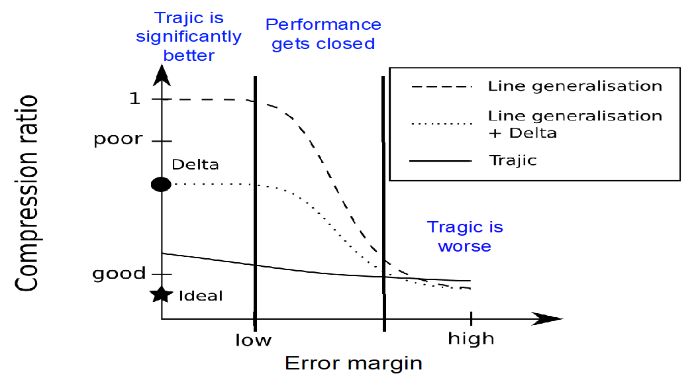

## DA4
> Each group is expected to revise the slidedeck using the feedback from reviewers and submit the revised slidedeck to the web. Please ensure that the group website has a link to your material. 

Our feedback came from G1, G2, and TA Mingzhou Yang.  Based on their reviews, we have made the following updates:

- Updated Alt-text for several images, including:
  - The following image on page 38:
  
  - The following image on page 44:
  
- Updated the Reading order so that all slides with a slide number now list that number second and their main title first.
- Deleted an unused text box on Page 20.
- Updated the various table information on several pages.
- Updated the order of the decision tree on page 48.
- Added description to table on page 51.
- Reorganized the flowchart information on page 52.
- Modified the table on page 48 to be easier to navigate.
- Modified chart flow reading order on page 23.
- Marked the flow charts on pages 23 and 48 as decorative.

As a result of these updates, there are no errors remaining in the accessibility checker.